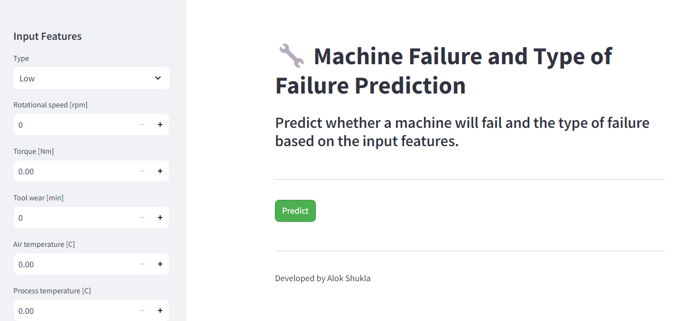
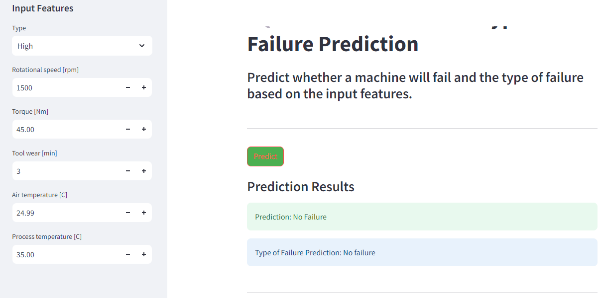

# Predictive-Analytics-for-Equipment-Failure
## 1. Overview
---
This design doc outlines the development of a web application for predictive maintenance using a synthetic dataset. The application will utilize machine learning models that:

- Evaluates whether the equipment will fail or not based on process parameters, including air and process temperatures, rotational speed, torque, and tool wear.

- Identifies the type of equipment failure in the event of a failure, based on the same process parameters.

## 2. Motivation
---
Predictive maintenance can help companies minimize downtime, reduce repair costs, and improve operational efficiency. Developing a web application for predictive maintenance can provide users with real-time insights into equipment performance, enabling proactive maintenance, and reducing unplanned downtime.

## 3. Success Metrics
---
The success of the project will be measured based on the following metrics:

- Precsion, recall, and F1 score of the machine learning models.
- Responsiveness and ease of use of the web application.
- Reduction in unplanned downtime and repair costs

## 4. Methodology
---
### 4.1. Problem Statement

The problem is to develop a machine learning model that predicts equipment failures based on process parameters.

### 4.2. Data

The dataset consists of more than 50,000 data points stored as rows with 14 features in columns. The features include process parameters such as air and process temperatures, rotational speed, torque, and tool wear. The target variable is a binary label indicating whether the equipment failed or not.

### 4.3. Techniques
We will utilize both a binary classification model, and a multi-class classification model to predict equipment failures, and type of equipment fauilure respectively. The following machine learning techniques will be used:

- Data preprocessing and cleaning
- Feature engineering and selection
- Model selection and training
- Hyperparameter tuning
- Model evaluation and testing

## Project Workflow

1. **Data Preprocessing**: Includes cleaning, encoding categorical features, and normalizing numerical features.
2. **Exploratory Data Analysis (EDA)**: Insights were gathered from the dataset to understand feature distributions and relationships.
3. **Model Building and Evaluation**: Various machine learning models were trained and evaluated to predict equipment failure and failure type.
4. **Web Application**: Developed using Streamlit to allow users to input feature values and receive predictions.

## Screenshots

Below are screenshots of the Streamlit web application:

*Input form and prediction button*

*Prediction results and failure type*

## Conclusion
The Predictive Analytics for Equipment Failure project leverages advanced machine learning techniques to provide valuable insights into equipment maintenance. By predicting both the likelihood of failure and the type of failure, the application helps organizations take proactive measures, potentially reducing operational costs and downtime.

The project demonstrates the practical application of predictive analytics in industrial settings and showcases the effectiveness of combining machine learning models with a user-friendly web interface.
